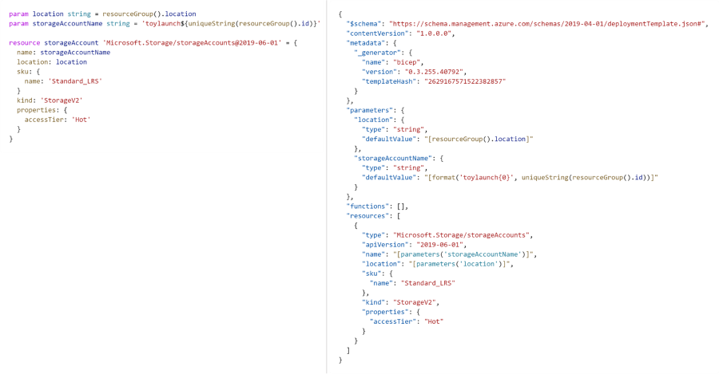

# Blueprint-Azure-Bicep-Event-Stream-POC-Accelerator

## Introduction
[Azure Bicep](https://docs.microsoft.com/en-us/azure/azure-resource-manager/bicep/overview?tabs=bicep) is a Resource Manager template language that's used to declaratively deploy Azure resources. Bicep is a domain-specific language, which means that it's designed for a specific scenario or "domain." Bicep isn't meant to be used as a standard programming language for writing applications. Bicep is used only to create Resource Manager templates. All resource types, API versions, and properties are valid in Bicep templates.

### Comparing ARM templates and Bicep

Bicep provides a simpler syntax to use when you're writing templates. Look at the following examples of two templates. The template on the left is a Bicep template. The template on the right is an ARM template(JSON).

## POC Scenario
A large manufacturing company is looking to align its demand forecasts with it's supply chain. Currently, a large number of internal groups are tracking progress of raw material delivery, assembly, testing, and shipping of final manufactured products. Progress includes updates from third party vendors on a variety of events such as shipment times and package locations as well as internal events such as IoT data from the manufacturing floor, final product assembly counts, and pick/pack operations. This data is stored in a variety of files types and databased that range from CSV and TSV to SQL and Azure Cosmos.

An internal project was started to create a streaming event platform. Producers of data would submit their data in its original form then the platform would convert that data into streaming events, run data quality checks, and make those events available in real-time to event consumers (such as a supply chain control tower application in progress from another internal project). The platform will create an event stream for each data producer.

## Pre-requisites
This POC leverages Azure Synapse for processing schema validation and data quality checks for each event stream. Before running the Azure Bicep files, an Azure Synapse workspace must be created and available.

## What Does This Accelerator Do?
The included Bicep file and parameters file event provisions an event hub, event hub namespace and Synapse spark pool for every new feed.

## What's Next?
We will be adding an Azure Pipeline deployment script and parameters to illustrate how this Bicep template can be integrated into a CI/CD pipeline.
